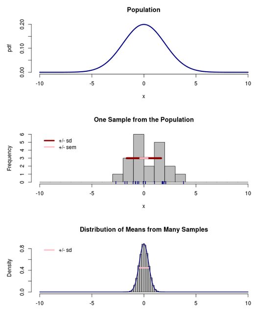
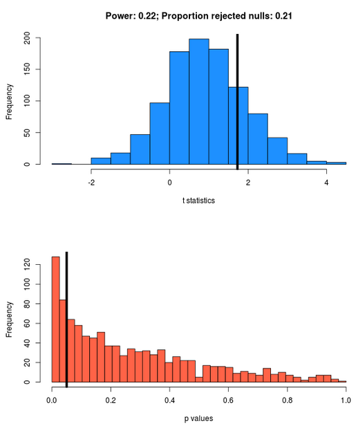
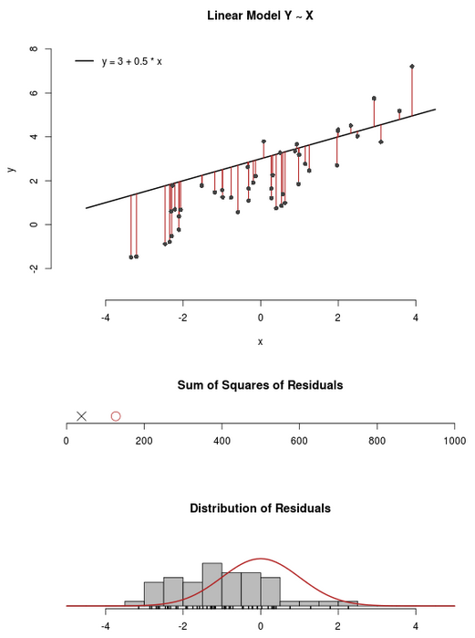
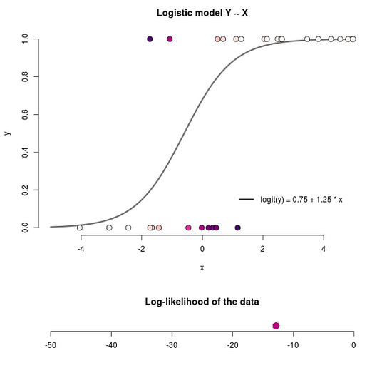
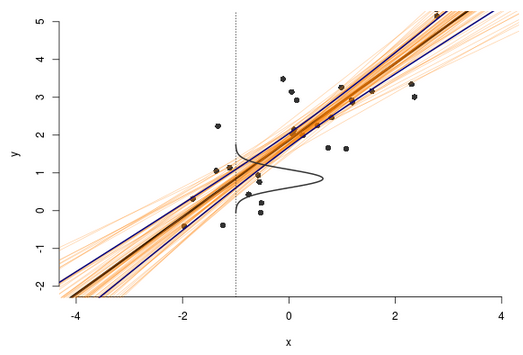
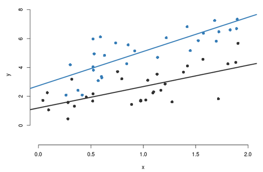
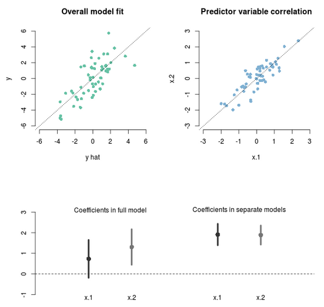
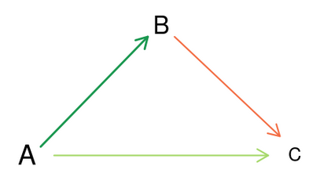

Statistical Examples
====================

This is a collection of web apps built using
[Shiny](http://www.rstudio.com/shiny/) to illustrate and help build
intuitions about some statistical concepts.

Sampling and standard error
---------------------------

[Link to app](https://supsych.shinyapps.io/sampling_and_stderr/)

This example demonstrates the relationship between the standard
deviation of a population, the standard deviation and standard error of
the mean for a sample drawn from that population, and the expected
distribution of means that we would obtain if we took many samples (of
the same size) from the population. It is meant to emphasize how the
standard error of the mean, as calculated from the sample statistics for
a single sample, corresponds to the width of the expected distribution
of means (under normal assumptions).

Simulating t tests
------------------

[Link to app](https://supsych.shinyapps.io/ttest_simulation/)

This example performs 1000 one-sample t tests (with different samples
from the same distribution) and plots the resulting histograms of t
statistics and p values. It is possible to control both the true effect
size (Cohen's D) and the number of observations in a sample to show how
these two parameters relate the expected distribution of scores. When
the effect size is 0, the simulation shows what happens when the null
hypothesis is true.

Simple linear regression
------------------------

[Link to app](https://gallery.shinyapps.io/regression_bootstrap/)

This example demonstrates the key objective of linear regression:
finding the coefficients for a linear model that minimize the squared
distance from each observation to the prediction made by the model at
the same value of x.

Simple logistic regression
--------------------------

[Link to app](https://supsych.shinyapps.io/logistic_regression/)

Similar to the linear regression example, this app shows how the goal of
logistic regression is to find a model (expressed in linear coefficients
-- here just the intercept and a slope term) that maximizes the
likelihood of the data you are fitting the model to.

Regression uncertainty
----------------------

[Link to app](https://gallery.shinyapps.io/regression_bootstrap/)

This app plots a simple linear regression and allows the user to
visualize the distribution of regression estimates from bootstrap
resamples of the dataset. The user can also plot a normal density with
mean at y-hat and standard deviation equal to the standard error of the
regression estimate at that point. The app thus draws a comparison
between the bootstrap procedure, the expected sampling characteristics
of the regression line, and a common way of visualizing the uncertainty
of a regression.

Modeling choices in multiple regression
---------------------------------------

[Link to app](https://gallery.shinyapps.io/multi_regression/)

This app plots a basic multiple regression with two variables: x, a
continuous measure, and group, a categorical measure. The app lets the
user choose whether to fit a simple regression, an additive multiple
regression, or an interactive multiple regression, and it shows the
`lm()` output and a visualization for each choice. The app also lets the
user control the true effect size for each component of the data to help
build intuition about the visual and statistical consequences of
different relationships between variables in a multiple regression.

Multicollinearity in multiple regression
----------------------------------------

[Link to app](https://gallery.shinyapps.io/collinearity/)

This app shows what happens to multiple regression results when there is
considerable covariance between two contiunous predictor variables. Although
the overall model fit does not change as the covariance is increased (as
visualized by the regression of y onto yhat and the R squared in the model
summary), the parameter estimates become unstable and the confidence intervals
expand, which yields large p values even though the relationship between the
predictors and the response variable does not change.

Simple mediation structure
--------------------------

[Link to app](https://supsych.shinyapps.io/mediation)

This app is intended to provide some intuition about simple mediation models.
It allows you to specify a range of causal structures by changing the strength
(and direction) of the relationships between three variables. Once you have
constructed a structure, you can observe the effects of manipulating the
system. Finally, you can simulate data from a model with the specified
structure and observe how changing the strength of the relationships influences
the regression parameters and inferential statistics.

